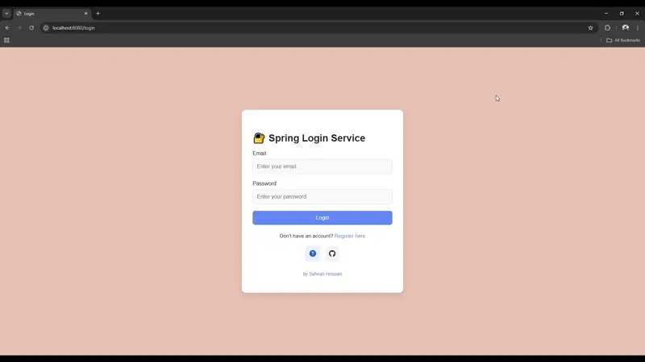

# Spring Login Service 


[](https://github.com/Safwan-Hossain/Spring-Login-Service/actions)


> End-to-end Spring Boot login & registration system with email verification, PostgreSQL persistence, Dockerized native builds, and Azure deployment.

---

A Spring Boot project focusing on secure login, email verification, and role based access control.  
Runs on a **PostgreSQL** database (deployed on **Azure**) and uses **GraalVM native images** for performance.  
GitHub Actions handles the **CI/CD** pipeline, automatically building and deploying **Docker** images to **Azure**.

---



## 📚 Table of Contents

- [Overview](#-overview)
- [Live Demo](#-live-demo)
- [Why It Matters](#-why-it-matters)
- [Getting Started](#-getting-started)
- [Configuration](#-configuration)

## 💼 Overview

- **CI/CD automation**: Built a GitHub Actions pipeline to compile GraalVM native images and deploy Docker containers to
  Docker Hub and Azure App Service
- **Spring Security**: Managed authentication, password encryption (BCrypt), and role based access control
- **Native Image Builds**: Leveraged GraalVM & Spring AOT for significantly optimized runtime performance
- **Database Integration**: Connection to PostgreSQL on Azure using Spring Data JPA
- **Email SMTP**: Asynchronous sending of account confirmation links

I built this project to get hands-on experience with a production grade Java stack used in real world backend systems

## 🌐 Live Demo
You can try the live version of this app here:
<sub></sub>
[**https://login.hossainsafwan.com**](https://login.hossainsafwan.com)

## 📌 Why It Matters

- Demonstrates a secure, production ready setup 
- Configured for real world cloud environments with proper handling of secrets via environment variables
- Built to scale, with features like login, email confirmation, and performance focused native builds

## 📦 Getting Started

To run the app locally:

```bash
# Clone the repo
git clone https://github.com/Safwan-Hossain/Spring-Login-Service.git

# Enter the directory
cd Spring-Login-Service

# Run with Maven (ensure port 8080 is free)
./mvnw spring-boot:run
```
Once the app is running, go to [http://localhost:8080/login](http://localhost:8080/login) to access the login page.


## ⚙️ Configuration

Configuration settings are organized across these property files:

|  File | Purpose                                              |
|--------|------------------------------------------------------|
| [`application.properties`](./src/main/resources/application.properties) | Shared default properties                            |
| [`application-local.properties`](./src/main/resources/application-local.properties) | Uses H2 Database and disables email sending          |
| [`application-prod.properties`](./src/main/resources/application-prod.properties) | For Production (PostgreSQL on Azure + Email Service) |

---

### 🔧 Default Behavior (Local)

By default, when you run the app locally:
- The **`local` profile** is active
- The app uses **H2 database (in memory)**
- **Email sending is disabled**

---

### 📧 To Enable PostgreSQL & Email

Update the following files:

- [`application.properties`](./src/main/resources/application.properties)
- [`application-local.properties`](./src/main/resources/application-local.properties)

Key configuration options include:

- `spring.datasource.*` -> PostgreSQL connection settings
- `email.enabled` -> `true` to enable email confirmation
- `spring.mail.*` -> SMTP server credentials
- `email.from` -> The sender email address for outgoing mail